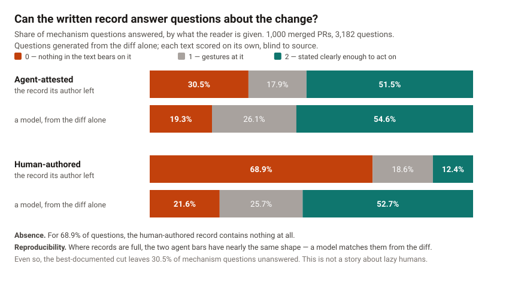

# How much of a change survives in the record

A study of 1,000 merged pull requests. It measures how much of the *mechanism* of a change is
recoverable from the record it leaves behind — the PR description plus the commit messages —
and whether that record contains anything a model could not have written from the diff alone.

Everything here is reproducible: one command per stage, every intermediate written to disk,
prompts in source, per-PR scores published as CSV.

---

## The finding

**A model reading only the diff explicitly answers 53.7% of mechanism questions about a
change. The record the change's author actually left answers 32.1%. For 49.6% of questions,
the record contains nothing at all.**



### What this does NOT mean

It does not mean "use a model to write your PR descriptions". That reading inverts the point.

The synthetic description was reconstructed from the diff by a model with no access to anyone's
intent, no memory of the discussion, and no knowledge of what was tried and abandoned. Whatever
it scores, it cannot be evidence that a person understood the change, because the artifact alone
was sufficient to produce it.

So the claim is about what a record can be used to *infer*:

> The written record contains almost nothing that is not recoverable from the code itself.
> It therefore cannot serve as evidence that any human understood the change. Documentation
> quality and human comprehension have come apart, and only one of them is being measured.

A complete PR description no longer licenses the inference reviewers actually draw from it.
If completeness is now free, completeness has stopped being the thing worth gating on.

### Two findings, not one

They are separate claims with separate evidence, and they end in the same place.

**1. Absence.** Where humans write the record unaided, often there is no record. For **68.9%**
of mechanism questions the human-authored record contains nothing at all — not a partial hint,
nothing. 30.6% of human PRs have a body that is the title alone, and another 22.8% have a body
that only restates the title or reports process ("rebase and fixing test").

**2. Reproducibility.** Where the record *is* full, a model reproduces it from the artifact.
On agent-attested PRs — only 2.2% of which are empty — the real record and the diff-derived
synthetic have nearly the same score profile (51.5% vs 54.6% explicit). This is the cleaner
finding, and it needs nobody to have written badly for it to hold.

Neither claim rests on the other. The result survives whichever arm a critic attacks.

**The best-documented cut is still not good.** Even on agent-attested PRs, 30.5% of mechanism
questions get nothing from the record. This is not a story about lazy humans.

### 3. The record does not cover more when the change is bigger

The share of mechanism questions a record answers is **flat across a tenfold range of change
size** — under 3 points of movement in either arm — while the synthetic arm moves 25-26 points
over the same range:

| arm | 20-49 | 50-149 | 150-499 | 500+ | range |
| --- | --- | --- | --- | --- | --- |
| agent — real record | 52.6 | 50.3 | 53.1 | 50.5 | **2.8** |
| human — real record | 10.6 | 12.5 | 13.3 | 13.4 | **2.7** |
| agent — synthetic | 63.2 | 65.1 | 61.1 | 38.7 | 26.4 |
| human — synthetic | 60.3 | 54.7 | 57.3 | 34.8 | 25.5 |

It is not that people write no more for larger changes — they write substantially more (agent
median record 656 → 3,279 chars across the range; human 122 → 291). The record *grows* with the
change while its *coverage* of the change stays put, because a bigger change has proportionally
more mechanism to explain.

> **Provenance predicts record coverage by ~37 points at every change size. Change size predicts
> almost nothing.**

Stakes vary; attention does not. That is the empirical case for scaling review effort by blast
radius rather than trusting that people write more when it matters more — measured on a thousand
merged PRs instead of assumed. See the caveat on causation below before leaning on it.

### The selection story is the explanation, not a nuisance

93% of the agent arm is a `Co-authored-by` trailer, which marks a PR from a team that uses
agents. Those records were plausibly model-drafted from the diff in the first place. That is
precisely *why* they reproduce: the cut where records are fullest is the cut where they are
most recoverable. Stated here rather than left for a reader to find.

---

## Results at a glance

All figures from independent scoring — each text judged alone, no A/B contrast. 1,000 PRs,
3,182 questions. Full output in [`results/`](results/).

| cut | arm | 0 absent | 1 partial | 2 explicit |
| --- | --- | --- | --- | --- |
| **All** | real record | 49.6% | 18.3% | **32.1%** |
| | paraphrased record | 50.2% | 20.0% | 29.9% |
| | synthetic (diff only) | 20.4% | 25.9% | **53.7%** |
| **Agent-attested** | real record | 30.5% | 17.9% | 51.5% |
| | synthetic (diff only) | 19.3% | 26.1% | 54.6% |
| **Human-authored** | real record | **68.9%** | 18.6% | 12.4% |
| | synthetic (diff only) | 21.6% | 25.7% | 52.7% |
| **Substantive records only** | real record | 35.4% | 20.4% | 44.2% |
| | synthetic (diff only) | 19.5% | 26.3% | 54.2% |

Means are reported in `results/three-arm-report.md` but should not be led with. The real-record
scores are bimodal — on the human arm, 68.9% at 0 and 12.4% at 2 — so a mean of 0.43 sits in the
trough and describes almost no actual PR.

---

## The controls, and what each one killed

### Form: does the scorer just favour text that looks model-written?

The sharpest objection to the whole design: the questions and the synthetic description come
from the same model reading the same diff by the same reasoning, so they share a decomposition
of the change and a vocabulary for it. The human record was never carved that way. A scorer
asked "does this text answer this question" could be partly measuring alignment rather than
information — and that would inflate the synthetic arm on *every* cut, including independent
scoring.

**The control.** Rewrite the real record in the model's own voice, adding no information
(`study paraphrase`). That arm has the synthetic's form and the record's content.

**Result: the form share is -5.0%, 95% CI [-9.0, -1.2].** Reformatting the record recovered
*none* of the distance to the synthetic. If anything it cost a little, presumably by dropping
detail in the rewrite. The gap is content, not form.

### That null is also a methods result

It stands independently of the finding. The paraphrase carries the model's headings, bullets,
code formatting and vocabulary, and scores the same as the raw record (0.82 vs 0.80 overall;
0.43 vs 0.43 on the human arm). A grader that rewarded polish, fluency or familiar structure
would have moved. This one did not.

That answers the standard objection to any LLM-judged study — *your grader is just rewarding
text that looks like model output* — with a measurement rather than an assurance.

### Verbosity: is the scorer rewarding length?

No. Record length predicts the real score (r=0.64 among non-empty records), but synthetic
length does **not** predict the synthetic score (r=-0.05). If the scorer were paying for words,
both would slope up.

### Contrast: does showing two texts together bias the comparison?

Yes, measurably, which is why the headline uses independent scoring. On a 49-PR pilot, paired
A/B scoring produced a gap of -0.64 against -0.47 independent. The entire shift was in the
synthetic arm (-0.18); the real arm did not move (-0.006). Paired presentation flatters the
model-written text. All headline figures here are independent.

### Emptiness: is this just PRs with no description?

No, but it is a large part of it. The gap narrows monotonically as thinner records are
excluded — -0.52 all, -0.27 substantive-only — and survives at every level.

---

## What the result does not cover

### Long records beat the model, and the curves cross around 1,200 characters

Reported continuously rather than at a threshold. Deciles of record length, with median change
size shown so the entanglement stays visible:

| decile | record chars | real | synthetic | gap | median diff lines |
| --- | --- | --- | --- | --- | --- |
| 6 | 536–808 | 39.7 | 61.6 | -21.9 | 120 |
| 7 | 814–1,206 | 44.7 | 59.6 | -14.9 | 184 |
| 8 | 1,218–2,037 | 58.2 | 56.3 | **+1.9** | 208 |
| 9 | 2,043–3,619 | 58.6 | 53.7 | +4.9 | 284 |
| 10 | 3,693–56,283 | 70.6 | 40.4 | **+30.2** | 1,411 |

The curves cross at roughly **1,200 characters** of record. An earlier version of this README
put the boundary at 3,000, which was a cutpoint chosen after seeing the data and had no defence
against "why 3,000?".

**The length effect is not diff size in disguise.** Splitting at the median record length
*within* each diff-size bucket, the long half beats the short half by +44.6, +32.1, +39.4 and
+50.6 points at 20-49, 50-149, 150-499 and 500+ changed lines. It survives conditioning at every
change size.

**But the inversion itself is an interaction and needs both factors:**

| | n | real | synthetic | gap |
| --- | --- | --- | --- | --- |
| long record + large diff | 92 | 69.1 | 34.7 | **+34.4** |
| long record + small diff | 34 | 73.4 | 68.8 | +4.6 |
| short record + large diff | 167 | 18.0 | 38.7 | -20.7 |
| short record + small diff | 707 | 28.3 | 59.4 | -31.1 |

Long-record and large-diff PRs overlap substantially but are not the same set (31.4% Jaccard;
73% of long-record PRs are also large-diff). A long record on a small change is roughly a tie; a
large change with a short record stays firmly negative. So this is one interaction, not two
independent routes to the same conclusion.

**Reproducibility reverses on large agent-attested changes** — real 50.5 against synthetic 38.7
at 500+ lines. Not merely weakening: reversing. That is the honest boundary of the claim. The
human arm never reverses, because its records stay near-empty at every size.

An earlier version also attributed the inversion to records whose prose already appears in the
diff — docs PRs where copying wins. That is wrong and is retracted. Only 29 PRs share any prose
with their diff, only 52% of those touch a markdown file, and the same inversion appears among
long-record PRs with **zero** overlap. The shingle flag was a proxy for verbosity.

### Selection, not causation — including for the product this ships next to

Everything about record length here is correlational.

People who write 5,000-character records are writing about changes that warranted the effort, in
teams whose culture rewards it, on work they understood well enough to explain. None of that is
established by this data, and none of it supports the claim that *compelling* length would
produce information. A mandated 3,000-character minimum would most likely produce 3,000
characters.

This matters for anyone tempted to cite this study in favour of a tool that asks for more
explanation, including Reckon. The causal version of this correlation is a bet. It is a
reasonable bet, and it is not a result.

The flatness finding above is on firmer ground, because it is a statement about what does *not*
vary rather than about what more writing would buy: coverage is invariant to change size, so
review effort cannot rely on authors self-scaling with stakes.

### Both terms of the agent/human contrast move

The synthetic arm is not constant across cuts (54.6% explicit on agent PRs against 52.7% on
human ones), because agent PRs are larger and the synthetic writer degrades with size. Holding
size fixed separates the two:

| size | real diff | synthetic diff |
| --- | --- | --- |
| 20-49 | **41.7** | -6.2 |
| 50-149 | **35.3** | -1.2 |
| 150-499 | **37.4** | -6.8 |
| 500+ | **35.4** | -8.6 |

Mean within-bucket: real **37.5 points**, synthetic **-5.7**. The contrast is carried by the
real arm at roughly six to one, in every bucket, and the synthetic term points the *other* way.
See `results/size-decomposition.md`.

---

## The open threat, and why it is still open

**Questions come from one generator with one prompt, reading the diff.** The paraphrase arm
shows the gap is not about surface form, but it cannot close a subtler version: questions
generated *from* a diff may over-weight what is locally visible in the diff, and a human
deciding what actually matters would weight it differently.

`study export-questions` produces a blinded worksheet — 35 PRs, stratified across record tiers,
diff only, no candidate texts — for a person to write mechanism questions by hand.
`study score-human-questions` then scores every arm against those.

**It ships unfilled.** There is deliberately no code path that can populate it. A language
model writing those questions — including the one that ran this pipeline — belongs to the same
class of generator as the one under test and would reproduce exactly the framing bias the
control exists to detect. Auto-filling it would not be a weaker control; it would be a fake one,
and indistinguishable in the output from a real one.

The same applies to `study handlabel-export`. **No human has labelled any of this.** Until
someone does, the study is one model grading another model's questions, and that remains its
single largest weakness. The paraphrase null constrains what that weakness can be — the grader
demonstrably ignores form — but it does not remove it.

---

## Reproducing this

```bash
cd study && npm install
npm run study -- clone && npm run study -- collect     # ~40 min
export OPENAI_API_KEY=...                              # or ANTHROPIC_API_KEY, or both
npm run study -- questions && npm run study -- synthetic && npm run study -- paraphrase
npm run study -- score3                                # the three-arm headline
npm run study -- analyze3 && npm run study -- decompose && npm run study -- chart
npm run study -- publish
```

**On determinism.** The sampling is seeded, so a rebuild against the *same clone state* draws
the same 1,000 PRs. It is not reproducible across time: the repos keep gaining commits, so the
eligible pool grows. Rebuilding this corpus a month after it was first collected drew 337
matched pairs against 342, and 16.4% empty records against 15.3%. Seeded sampling fixes the
draw, not the population.

### Which models get used

Generation takes the stronger model, scoring the cheaper one — writing a description is the
hard task, judging whether a text answers a question is the easy one.

| Keys present | Generation | Scoring |
| --- | --- | --- |
| Both | `claude-sonnet-5` | `gpt-5.4-mini` |
| OpenAI only | `gpt-5.4` | `gpt-5.4-mini` |
| Anthropic only | `claude-sonnet-5` | `claude-haiku-4-5-20251001` |

Override with `STUDY_GEN_MODEL` / `STUDY_SCORE_MODEL`. The published run used
`openai:gpt-5.4` for generation and `openai:gpt-5.4-mini` for scoring; `results/manifest.json`
records what actually ran, read back from the run artifacts rather than from environment
variables.

**Cross-vendor was not available for this run.** With both keys the two roles land on different
vendors, which is the strongest version of "a model does not judge its own output". This run had
only an OpenAI key, so both roles are OpenAI — different models, same vendor and same training
lineage. A cross-vendor replication would be the natural next check on whether shared lineage
between the question generator and the synthetic writer does any work the paraphrase arm did not
already rule out.

---

## Pipeline

| Stage | Command | Reads | Writes |
| --- | --- | --- | --- |
| 1 collect | `study collect` | git clones | `meta.json`, `diff.patch`, `record.md` |
| 2 questions | `study questions` | `diff.patch` **only** | `questions.json` |
| 3 synthetic | `study synthetic` | `diff.patch` **only** | `synthetic.md` |
| 3b paraphrase | `study paraphrase` | `record.md` **only** | `paraphrase.md` |
| 4 score | `study score` | `record.md`, `synthetic.md` **only** | `scores.json`, `blind.json` |
| 4b score3 | `study score3` | the three texts **only** | `scores3.json` |
| 5 match | (used by analyze) | `meta.json` | matched pairs |
| 6 analyze | `study analyze` / `analyze3` / `decompose` / `chart` | scores | reports, CSVs, SVG |
| — validate | `study export-questions`, `handlabel-export` | | worksheets (**fill by hand**) |

Stage 2 calls Reckon's **production** `decompose()` from `@reckon/core`, unmodified. The study
measures the world with the instrument the product ships, so a result here is a claim about
Reckon's own question generator rather than about a research prompt nothing else uses. Large
diffs go through the same `diffDigest` production uses, so every changed file is represented.

## Information separation

One result worth defending, and two ways to void it: letting the description reach the question
generator, or letting the diff reach the scorer.

1. **Structural.** Diff and record live in separate files behind `PrReader`, scoped per stage.
   A diff-only stage calling `readRecord()` throws, and vice versa. No struct carries both.
2. **Containment.** Stage 2 and 3 prompts are asserted to be a subset of the diff.
3. **No raw patch in the scorer.** Stage 4 and 4b prompts are rejected if they contain diff
   syntax.

A tripped guard aborts the run — never a warning, because a run that continued past a leak
would produce numbers indistinguishable from clean ones. `npm test` pins both directions: that
the guard still fires on a real leak, and that it stays silent on the legitimate cases that
made earlier versions misfire.

The paraphrase stage holds a **record-only** reader, so it cannot reach the diff and supply
mechanism it read out of the code.

### A correction worth reading

The first containment check tested stage-2 prompts for overlap with `record.md`. On the pilot
it fired twice and neither was leakage — once on a file path in both, once on a docs PR whose
diff *adds* the prose its description summarises.

The check could never have detected what it claimed to. Stage 2 builds its prompt by digesting
`diff.patch`; every token already came from the diff, so overlap with the record can only mean
the two genuinely share content. It was replaced by the containment assertion above, and the
overlap it was accidentally measuring is now recorded per PR as `recordDiffSharedShingles`.

## Blinding

In paired mode the scorer sees two texts as A and B, ordered by a seeded hash, and is never told
which is real; the mapping is written to `blind.json` *after* scoring. In independent mode —
which the headline uses — each prompt contains a single unlabelled text, so there is nothing to
blind.

Agent attribution trailers are stripped from the record at collection time, for two independent
reasons: they would tell the scorer which arm the PR is in, and they carry no mechanism. Only
attribution lines are removed; prose is never touched, including prose that mentions an agent.

## The rubric

Per question, per text: **0** nothing bears on it, **1** gestures at it, **2** stated clearly
enough to act on without reading the code. Report the distribution, not the mean.

## The corpus

1,000 PRs (500 agent-attested, 500 human) from 47,887 eligible merges across five repositories,
with 544 candidates dropped by the exclusion filter.

Repos are admitted on their **merge convention**, never on the richness of any individual PR:
the record is reconstructed from git, which is only sound where merging preserves the
description. Admission requires ≥25% of recent merges to carry a non-trivial body.

| Repo | Body density | Verdict |
| --- | --- | --- |
| prisma/prisma | 95% | admitted |
| supabase/supabase | 85% | admitted |
| apache/airflow | 47% | admitted |
| langchain-ai/langchain | 42% | admitted |
| grafana/grafana | 41% | admitted |
| withastro/astro | 17% | rejected — below threshold |
| home-assistant/core, n8n-io/n8n | 0% | rejected — squashes with title only |
| django/django, kubernetes/kubernetes | n/a | rejected — description never enters git |

Sampling the 0% repos would measure "the merge button discarded what they wrote", not "authors
documented nothing". **Within** an admitted repo an empty description is real data and is kept:
filtering on body length would condition the sample on the outcome being measured.

### Record tiers

`emptyBody` alone was too lenient — it counts a record as written whenever any body exists.
125 PRs (12.5%) have a body that carries nothing beyond the title. So triviality is graded:

| tier | all | agent | human |
| --- | --- | --- | --- |
| empty (title alone) | 16.4% | 2.2% | 30.6% |
| trivial (restates title / process chatter) | 12.5% | 2.2% | 22.8% |
| substantive | 71.1% | 95.6% | 46.6% |

The tier keys on whether the author wrote anything beyond the title, never on whether it is any
good. Excluding records for being *bad* would condition the sample on the outcome; excluding
them for being *absent* is describing the sample.

### What the agent label means

AIDev was unreachable, so provenance comes from git, and it is weaker than AIDev's label:

- `bot-author` — the commit author **is** an agent account. Genuine agent authorship. **13 PRs.**
- `agent-trailer` — a `Co-authored-by:` line naming an agent. Attests **assistance**. **468 PRs.**
- `agent-footer` — a "Generated with Claude Code" style footer. Same caveat. **19 PRs.**

**This corpus can only speak about agent-ASSISTED pull requests**, and any writeup must say so
in those words. The bot-author-only robustness check runs but has 12 matched pairs — same
direction (0.76, CI [0.19, 1.31]), far too few to lean on.

## Statistics

Uncertainty is **cluster bootstrap over PRs**, not over questions. Each PR yields 2-4 questions
scored against the same texts, so treating ~3,200 questions as independent observations would
shrink every interval by roughly √(cluster size) and manufacture significance.

All arm comparisons are paired by construction — same PR, same questions — so the bootstrap
resamples PRs and recomputes the mean per-PR difference.

## Threats to validity

- **No human has labelled anything.** The largest one. See "The open threat" above.
- Questions come from one generator with one prompt; a different generator would ask different
  questions. Partially addressed by the paraphrase null; not fully.
- Questions generated from a diff over-weight what is locally visible and under-weight
  architectural context.
- Both roles ran on one vendor. Cross-vendor replication is the obvious next check.
- Public open-source repos are not representative of private codebases, and their review
  culture is stronger.
- Agent-labelled PRs are a biased sample — teams that let agents open PRs are unusual teams,
  and their records were plausibly model-drafted, which is the explanation for the
  reproducibility result rather than a nuisance.
- Repos are admitted on merge convention, which correlates with engineering practice.
- prisma's history within the window is short (from 2025-10), so it contributes a narrower
  calendar slice.
- **The record is not the only channel.** Real teams have Slack, standups and shared context
  that never enters the repo. This is the most serious objection to the premise — then note
  that none of those channels survive turnover either, which is exactly the point.

## Isolation from the product

`study/` is self-contained and one-directional. Nothing in the product references it, and it
references nothing outside itself. The Docker image never copies it; the root build does not
compile it; it has its own manifest and lockfile.

Stage 2 needs the production `decompose()` and both generation stages need the production
`diffDigest`, so those two artifacts are vendored verbatim. `npm test` compares each copy
byte-for-byte against its original and **fails** on any difference. In an extracted standalone
checkout the originals are absent and the check reports them unverifiable rather than failing.
See `src/vendor/PROVENANCE.md`.

```bash
git subtree split -P study -b study-standalone   # lifts cleanly into its own repo
```
